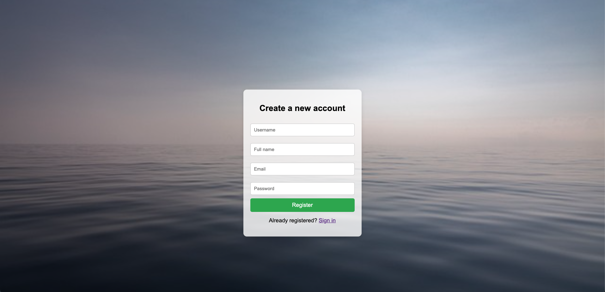
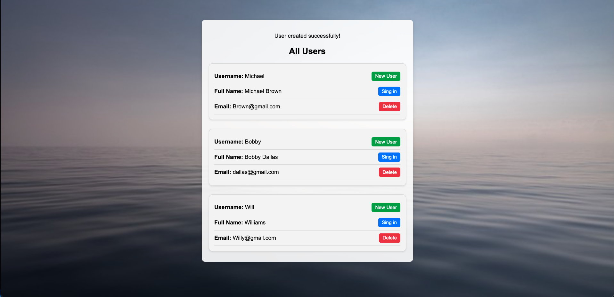

# Login System - PHP Project

This project is a simple login system built using PHP, allowing users to create accounts, log in, and manage user data with MySQL for secure storage.

## Features

- **User Registration**: Securely register users with hashed passwords
- **User Login**: Authenticate users with username and password
- **User Deletion**: Ability to delete user accounts
- **CSRF Protection**: Added CSRF tokens on forms for security
- **Consistent Design**: Background image and centered forms for a clean look
- **User Notifications**: Feedback for successful and failed actions

## Project Progress

## Screenshot of the registration

The project evolved from a basic login form into a fully functional user management system with enhanced security and design elements.

### Development Steps:

1. **Database Setup**: Established MySQL connection and created a users table
2. **User Registration & Login**: Built forms for registration and login
3. **CSRF Security**: Added tokens to forms to prevent cross-site request forgery
4. **User Management**: Implemented user deletion functionality
5. **UI/UX Design**: Added a background image, centered forms, and notifications
6. **Feedback Notifications**: Displayed notifications for successful and failed actions

## Screenshot of the added users

## YouTube Link

Watch the project demo on YouTube: [Project Demo](https://youtu.be/hVUhCglLaJ8)

## Installation Instructions

1. **Clone the Project**: Clone the project from GitHub
2. **Database Setup**:
   - Set up a MySQL database with XAMPP or a similar tool
   - Create a `users` table with fields for user ID, username, full name, email, and hashed password
3. **Configure Database in PHP**: Update `Database.php` with your database credentials
4. **Start the Server**: Run the project on a local server and access it in your browser

## Future Development Ideas

- **Profile Management**: Add profile editing and password reset functionality
- **User Roles**: Differentiate users with roles like admin and regular user
- **Responsive Design**: Adapt layout for mobile devices
- **Enhanced Security**: Implement additional security measures such as account lockout on repeated failed login attempts
